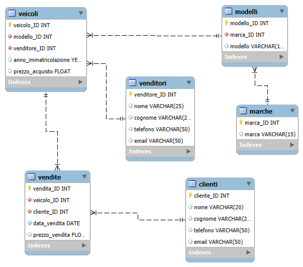

# 🚗 **Car Dealership - Database and Management**



Welcome! This repository contains a comprehensive **Car Dealership Management System** to manage a car dealership's data. It includes functionalities for managing vehicles, sales, vendors, clients, and more using a MySQL database.

---

## 💻 **Who is this for?**
- **Developers:** Anyone interested in working with databases and MySQL.
- **Car Dealerships:** Ideal for small businesses to manage car sales and inventory.
- **Students:** Those learning about database design, foreign keys, and relational databases.

---

## 📂 **Project Structure**
- **Database:** Designed with tables for sellers, vehicles, clients, sales, and more.
- **ER Diagram:** A visual representation of the relationships between the entities.
- **Stored Procedure:** Helps populate the database with sample data.

---

## 🔍 **Features**
- **Vendor Management:** Track vendors and their details.
- **Vehicle Sales:** Record vehicle sales with client and vendor references.
- **Client Management:** Store client contact information and sales history.
- **Vehicle Inventory:** Track vehicle details, including model, brand, and year of manufacture.
- **Automated Insertion:** Insert sample data using a stored procedure for demo purposes.

---

## 📊 **ER Diagram**
Below is the **Entity-Relationship Diagram (ERD)** that shows how the tables are connected:


---

## 🔗 **Referential Integrity**
All tables are linked through foreign keys to ensure referential integrity:

- **Vehicles** is linked to **Salespeople** and **Models**.
- **Sales** is linked to **Vehicles** and **Customers**.
- **Models** is linked to **Brands**.

Referential integrity ensures:
- No orphaned data (e.g., a sale cannot reference a vehicle that doesn't exist).
- Correct relationships between tables.

---

## 🛠️ **Stored Procedure**
The project includes a stored procedure called `Insert_data`, which populates the database with sample data. The stored procedure handles a transaction to ensure all data is correctly inserted and rolls back any changes if an error occurs, preventing partial data insertion.

**Stored Procedure Features:**
- Manages the insertion of data into 6 tables: salespeople, brands, customers, models, vehicles, and sales.
- Ensures data consistency through a transaction.

---

## 💡 **Database Creation**
To create the database and populate it with sample data, follow these steps:

1. **Create the database:**
   ```sql
   CREATE DATABASE IF NOT EXISTS Car_Dealership;
   USE Car_Dealership;
